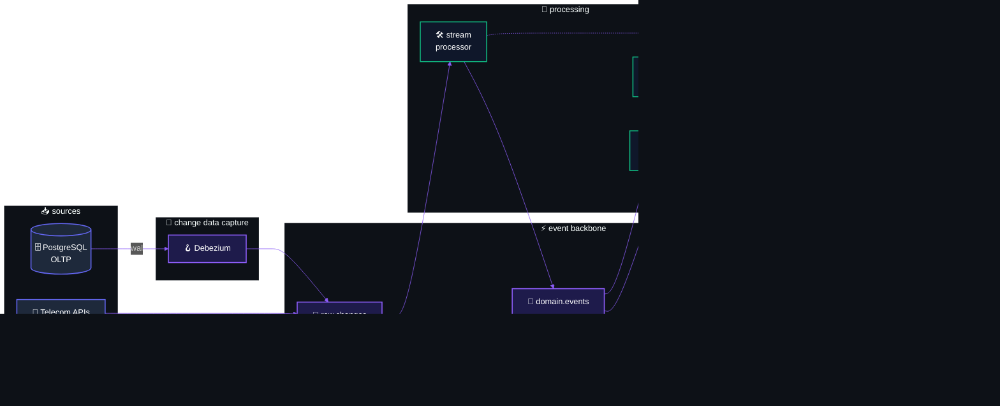
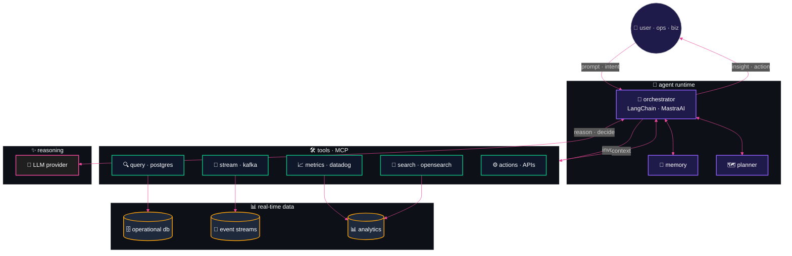
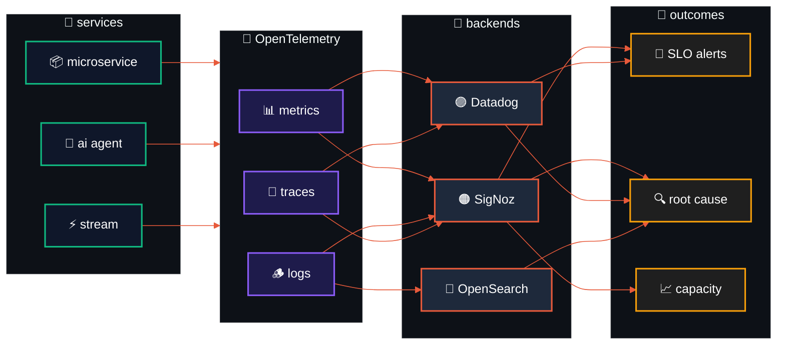

<!-- ═══════════════════════════════════════════════════════════════════════════ -->
<!--                    ✦  M I Q U E I A S   P E R E I R A  ✦                   -->
<!--                  cinematic · interactive · event-driven                    -->
<!-- ═══════════════════════════════════════════════════════════════════════════ -->

<a name="top"></a>

<!-- ─────────────  HERO · WAVING CAPSULE + ANIMATED TYPING TITLE  ───────────── -->

<div align="center">

<!-- decorative animated wave (no text — keeps animation crisp) -->


<!-- animated fluent brain emoji -->


<!-- animated identity title (truly cycles) -->
<h1>
  
</h1>

<!-- animated subtitle stream -->
<a href="https://github.com/Miqueias97">
  
</a>

<br/><br/>

<!-- chip row · status -->
<kbd>🟢 status: shipping</kbd>
<kbd>🌎 GMT-3 · São Paulo</kbd>
<kbd>⚙️ kotlin · kafka · ai</kbd>
<kbd>🎯 open to collab</kbd>

<br/><br/>

<!-- contact row -->
<a href="https://www.linkedin.com/in/miqueias-nascimento-eng/"></a>
<a href="mailto:miqueiasnascimentonp@hotmail.com"></a>
<a href="https://github.com/Miqueias97"></a>


</div>

<!-- divider gradient bar -->


<br/>

<!-- ─────────────────  SECTION NAV  ───────────────── -->

<div align="center">
  <sub>📂 &nbsp;<em>navegação · clique em qualquer seção para expandir</em></sub>
  <br/><br/>
  <a href="#whoami"></a>
  <a href="#stack"></a>
  <a href="#eda"></a>
  <a href="#agents"></a>
  <a href="#projects"></a>
  <a href="#observability"></a>
  <a href="#stats"></a>
</div>

<br/>

<!-- ─────────────────  SECTION: WHOAMI  ───────────────── -->

<a name="whoami"></a>

<details open>
<summary>
  
</summary>

<br/>

<table align="center" border="0" width="100%">
  <tr>
    <td valign="top" width="55%">

<h3>&nbsp;<code>$ ./whoami --verbose</code></h3>

```kotlin
data class Engineer(
    val name:    String  = "Miqueias Pereira",
    val role:    String  = "Full Stack Software Engineer",
    val company: String  = "Cobli",
    val tags:    Set<Tag> = setOf(
        Tag.DISTRIBUTED_SYSTEMS,
        Tag.EVENT_DRIVEN,
        Tag.AI_AGENTS,
        Tag.DDD_HEXAGONAL,
        Tag.HIGH_PERFORMANCE
    ),
    val throughput: Long = 300_000L, // records/hour
    val mission:    String = """
        Transform legacy architectures into
        intelligent, event-driven ecosystems
        where data flows, agents reason and
        systems heal themselves.
    """.trimIndent()
) : ProblemSolver, SystemThinker
```

<blockquote>
<em>Da linha de frente da logística à arquitetura de sistemas distribuídos de alta performance.</em><br/>
<em>Entendo o impacto de um milissegundo de latência — tanto no código quanto no mundo real.</em>
</blockquote>

</td>
<td valign="top" width="45%">

<h3>&nbsp;<code>$ system.metrics()</code></h3>

<table border="0">
  <tr>
    <td align="center"><sub>EVENTS / HOUR</sub><br/><h2>300K+</h2><sub>📡 kafka streams</sub></td>
    <td align="center"><sub>UPTIME TARGET</sub><br/><h2>99.95%</h2><sub>🟢 high-availability</sub></td>
  </tr>
  <tr>
    <td align="center"><sub>AI AGENTS</sub><br/><h2>LIVE</h2><sub>🤖 in-product + internal</sub></td>
    <td align="center"><sub>ARCH STYLE</sub><br/><h2>EDA</h2><sub>⚡ ddd · hexagonal</sub></td>
  </tr>
</table>

<br/>

<sub><strong>🟢 currently shipping</strong></sub>

- 🛰️ &nbsp;Pipelines de Telecom · CDC end-to-end
- 🤖 &nbsp;Agentes internos com acesso a dados em tempo real
- 🧠 &nbsp;Agentes integrados ao produto Cobli
- 🧱 &nbsp;Microsserviços críticos em Kotlin + Spring Boot
- 🛡️ &nbsp;Idempotência ponta a ponta · resiliência

</td>
  </tr>
</table>

<br/>

<!-- philosophy / manifesto block -->
<div align="center">

<table align="center" width="92%">
  <tr>
    <td align="center">
      <h4>📜 &nbsp;manifesto</h4>
      <table border="0" width="100%">
        <tr>
          <td align="center" width="33%"><h3>🧠</h3><strong>think in events</strong><br/><sub>state is a side-effect<br/>of facts over time</sub></td>
          <td align="center" width="33%"><h3>🛡️</h3><strong>design for failure</strong><br/><sub>idempotency · retries<br/>graceful degradation</sub></td>
          <td align="center" width="33%"><h3>📈</h3><strong>measure to know</strong><br/><sub>traces · slos · dashboards<br/>data &gt; opinion</sub></td>
        </tr>
      </table>
    </td>
  </tr>
</table>

</div>

</details>

<br/>

<!-- ─────────────────  SECTION: TECH STACK  ───────────────── -->

<a name="stack"></a>

<details>
<summary>
  
</summary>

<br/>

<div align="center">

<h4><code>&lt; languages /&gt;</code></h4>

<a href="https://skillicons.dev"></a>

<h4><code>&lt; backend · frameworks /&gt;</code></h4>

<a href="https://skillicons.dev"></a>

<h4><code>&lt; frontend · ui /&gt;</code></h4>

<a href="https://skillicons.dev"></a>

<h4><code>&lt; data · streaming /&gt;</code></h4>

<a href="https://skillicons.dev">

</a>

<h4><code>&lt; ai · agents · llm /&gt;</code></h4>


<h4><code>&lt; cloud · devops /&gt;</code></h4>

<a href="https://skillicons.dev"></a>

<h4><code>&lt; observability /&gt;</code></h4>


<h4><code>&lt; methodologies · principles /&gt;</code></h4>


</div>

</details>

<br/>

<!-- ─────────────────  SECTION: EVENT-DRIVEN  ───────────────── -->

<a name="eda"></a>

<details>
<summary>
  
</summary>

<br/>



<table align="center" width="100%">
  <tr>
    <td align="center" width="25%"><h2>📨</h2><strong>Kafka</strong><br/><sub>high-throughput<br/>event backbone</sub></td>
    <td align="center" width="25%"><h2>🪝</h2><strong>Debezium · CDC</strong><br/><sub>data flowing<br/>without polling</sub></td>
    <td align="center" width="25%"><h2>🛡️</h2><strong>Idempotência</strong><br/><sub>at-least-once safe<br/>end-to-end</sub></td>
    <td align="center" width="25%"><h2>🔁</h2><strong>Backpressure</strong><br/><sub>retries · DLQ<br/>self-healing</sub></td>
  </tr>
</table>

<br/>

<!-- live throughput "monitor" -->
<div align="center">

<sub>📡 &nbsp;<strong>live throughput · last 60s</strong></sub>

```log
ingress     ████████████████████████████████░░░░░░░░░  82%   ▲  264k events/h
processing  ██████████████████████████████░░░░░░░░░░░  76%   ▲  consumer lag: 2ms
egress      ████████████████████████████░░░░░░░░░░░░░  72%   ▼  back-pressure ok
errors      █░░░░░░░░░░░░░░░░░░░░░░░░░░░░░░░░░░░░░░░░   1%   ▬  0.04% retry rate
SLO budget  ███████████████████████████████████████░░  97%   🟢 healthy · burning slow
```

</div>

</details>

<br/>

<!-- ─────────────────  SECTION: AI AGENTS  ───────────────── -->

<a name="agents"></a>

<details>
<summary>
  
</summary>

<br/>



<table align="center" width="100%">
  <tr>
    <td valign="top" width="50%">
      <h4>🤖 &nbsp;internal agents</h4>
      <ul>
        <li><strong>quem usa</strong> · times de negócio + operação</li>
        <li><strong>pra quê</strong> · transformar dados dispersos em decisões</li>
        <li><strong>como</strong> · acesso a dados em tempo real via MCP + Kafka</li>
        <li><strong>resultado</strong> · respostas acionáveis em segundos</li>
      </ul>
    </td>
    <td valign="top" width="50%">
      <h4>🧠 &nbsp;product agents</h4>
      <ul>
        <li><strong>quem usa</strong> · usuário final Cobli</li>
        <li><strong>pra quê</strong> · automatizar interações + gerar insights</li>
        <li><strong>como</strong> · embarcados no fluxo do produto</li>
        <li><strong>resultado</strong> · UX inteligente · 24/7</li>
      </ul>
    </td>
  </tr>
</table>

<br/>

<!-- agent reasoning trace -->
<div align="center">

<sub>🧠 &nbsp;<strong>agent reasoning · sample trace</strong></sub>

```log
[14:32:01]  🟢 user · "qual a frota com maior consumo nas últimas 24h?"
[14:32:01]  🎯 orchestrator · classificando intenção → analytical_query
[14:32:01]  🗺️  planner · plano com 3 steps
[14:32:02]  🛠️  tool[query·postgres]    ✓  fleets joined (24h window)   42ms
[14:32:02]  🛠️  tool[stream·kafka]      ✓  telemetry events sampled     38ms
[14:32:02]  🧩  llm · sintetizando insight com contexto fresco
[14:32:03]  💡 response · "frota X consumiu 18% acima da média · 3 veículos críticos"
[14:32:03]  ✅ end-to-end latency: 1.8s · 0 hallucinations · sources cited
```

</div>

</details>

<br/>

<!-- ─────────────────  SECTION: PROJECTS  ───────────────── -->

<a name="projects"></a>

<details open>
<summary>
  
</summary>

<br/>

<div align="center">
  <sub><em>📖 &nbsp;Cada projeto é apresentado como um "trace" — como um dashboard de sistema.<br/>
  Clique para ver o que ele faz, por que importa e (opcionalmente) como funciona por baixo.</em></sub>
</div>

<br/>

<table align="center" width="100%">
  <tr>
    <td align="center" width="33%">
      <sub>ACTIVE PROJECTS</sub><br/>
      <h3>3</h3>
      <sub>shipping &amp; experimenting</sub>
    </td>
    <td align="center" width="33%">
      <sub>FOCUS AREAS</sub><br/>
      <h3>AI · Data · Backend</h3>
      <sub>three pillars</sub>
    </td>
    <td align="center" width="33%">
      <sub>OVERALL HEALTH</sub><br/>
      <h3>🟢 healthy</h3>
      <sub>all systems go</sub>
    </td>
  </tr>
</table>

<br/>

<!-- ───────── PROJECT 01 · langchain-with-mcp ───────── -->

<details>
<summary>
  &nbsp;<kbd>🤖 AI</kbd>&nbsp;&nbsp;<strong>LangChain + MCP</strong> &nbsp;·&nbsp; <em>Smart agents that can read live data &amp; take actions</em> &nbsp;·&nbsp; <code>🟢 active</code>
</summary>

<br/>

### 🧠 &nbsp;What this project does

> Builds AI assistants that don't just chat — they can **look up real data** (databases, APIs, metrics) and **take actions** on your behalf, in real time.

### 🎯 &nbsp;Why this is valuable

- **For users** → answers based on *current* data, not stale training knowledge
- **For teams** → an AI that can actually *do things*, not just describe them
- **For the business** → fewer manual lookups, faster decisions

### ⚙️ &nbsp;How it works

Uses the **Model Context Protocol (MCP)** — an open standard that lets AI agents safely connect to tools like databases, search engines, and APIs through a universal interface.

<br/>

<details>
<summary>&nbsp;<sub>🔍 &nbsp;<em>behind the scenes · technical trace</em></sub></summary>

<br/>

```log
trace_id    : lc-mcp-001
service     : ai-agents
runtime     : python · langchain · mcp
latency     : 182ms (p50: 154ms · p95: 210ms)
status      : 🟢 success
```

```log
├── 🟢 ingest      ████░░░░░░░░░░░░░░░░   34ms   mcp · tools interface
├── 🟢 plan        ░░░░██░░░░░░░░░░░░░░   18ms   langchain · planner
├── 🟢 reason      ░░░░░░██████████░░░░   98ms   llm · decision layer
└── 🟢 output      ░░░░░░░░░░░░░░░░░██░   32ms   tool execution · real-time
```

</details>

<p>
<a href="https://github.com/Miqueias97/langchain-with-mcp">
  
</a>
</p>

</details>

<!-- ───────── PROJECT 02 · event-driven-experiments ───────── -->

<details>
<summary>
  &nbsp;<kbd>⚡ DATA</kbd>&nbsp;&nbsp;<strong>Real-Time Data Pipelines</strong> &nbsp;·&nbsp; <em>Moving thousands of events per second, reliably</em> &nbsp;·&nbsp; <code>🟡 in progress</code>
</summary>

<br/>

### 🧠 &nbsp;What this project does

> Captures changes happening in databases and apps **the moment they occur**, then ships that data to wherever it's needed — dashboards, AI agents, search, alerts — without losing or duplicating anything.

### 🎯 &nbsp;Why this is valuable

- **For users** → see fresh data instantly, not "last updated 1 hour ago"
- **For teams** → no more nightly batch jobs that break and need babysitting
- **For the business** → handles `300k+ events/hour` without dropping a beat

### ⚙️ &nbsp;How it works

**Change Data Capture (CDC)** with `Debezium` listens to the database and publishes every change to `Kafka`. Smart consumers process events in order, recover from failures automatically, and never process the same event twice.

<br/>

<details>
<summary>&nbsp;<sub>🔍 &nbsp;<em>behind the scenes · technical trace</em></sub></summary>

<br/>

```log
trace_id    : eda-002
service     : streaming
runtime     : kotlin · kafka · debezium
latency     : 441ms (p50: 380ms · p95: 520ms)
status      : 🟡 work-in-progress
```

```log
├── 🟢 capture     ███░░░░░░░░░░░░░░░░░   62ms   debezium · cdc · postgres wal
├── 🟢 publish     ░░░██░░░░░░░░░░░░░░░   48ms   kafka · raw.changes
├── 🟡 transform   ░░░░░██████░░░░░░░░░  140ms   stream processor · kotlin
├── 🟢 consume     ░░░░░░░░░░░██████░░░  138ms   idempotent consumer
└── 🟢 sink        ░░░░░░░░░░░░░░░░░██░   53ms   warehouse · opensearch
```

</details>

<p>
<a href="https://github.com/Miqueias97?tab=repositories">
  
</a>
</p>

</details>

<!-- ───────── PROJECT 03 · microservice-template ───────── -->

<details>
<summary>
  &nbsp;<kbd>🧱 BACKEND</kbd>&nbsp;&nbsp;<strong>Microservice Blueprint</strong> &nbsp;·&nbsp; <em>A template for building services that age well</em> &nbsp;·&nbsp; <code>🧪 lab</code>
</summary>

<br/>

### 🧠 &nbsp;What this project does

> A reusable starting point for new backend services — already wired with the patterns that keep code **easy to change** as the product grows.

### 🎯 &nbsp;Why this is valuable

- **For developers** → start a new service in minutes, not days
- **For teams** → consistent structure across the company, less onboarding friction
- **For the business** → less rewrites, faster feature delivery long-term

### ⚙️ &nbsp;How it works

Built on **DDD + Clean Architecture + Hexagonal** — three patterns that keep business logic *separate* from databases, frameworks, and external APIs. Translation: you can swap the database (or anything else) without touching the rules of your product.

<br/>

<details>
<summary>&nbsp;<sub>🔍 &nbsp;<em>behind the scenes · technical trace</em></sub></summary>

<br/>

```log
trace_id    : ms-003
service     : backend
runtime     : kotlin · spring boot
latency     : 228ms (p50: 195ms · p95: 270ms)
status      : 🧪 lab · experimental
```

```log
├── 🟢 adapter     ████░░░░░░░░░░░░░░░░   42ms   ports & adapters · http in
├── 🟢 application ░░░░██░░░░░░░░░░░░░░   28ms   use case · orchestration
├── 🟢 domain      ░░░░░░██████░░░░░░░░   78ms   ddd · business rules
├── 🟢 repository  ░░░░░░░░░░░░██░░░░░░   46ms   hexagonal · port out
└── 🟢 response    ░░░░░░░░░░░░░░░░░██░   34ms   http out · serialization
```

</details>

<p>
<a href="https://github.com/Miqueias97?tab=repositories">
  
</a>
</p>

</details>

<br/>

<div align="center">
  <sub><em>Quer ver tudo que estou trabalhando?</em></sub>
  <br/><br/>
  <a href="https://github.com/Miqueias97?tab=repositories">
    
  </a>
</div>

</details>

<br/>

<!-- ─────────────────  SECTION: ARCHITECTURE PRINCIPLES  ───────────────── -->

<details>
<summary>
  
</summary>

<br/>

<table align="center" width="100%">
  <tr>
    <td align="center" width="25%">
      <h2>🧩</h2>
      <h4>Domain-Driven<br/>Design</h4>
      <sub>Bounded Contexts<br/>Linguagem ubíqua<br/>Domínio ⟷ infra</sub>
    </td>
    <td align="center" width="25%">
      <h2>🏛️</h2>
      <h4>Clean +<br/>Hexagonal</h4>
      <sub>Regras isoladas<br/>Ports &amp; Adapters<br/>Alta manutenibilidade</sub>
    </td>
    <td align="center" width="25%">
      <h2>⚡</h2>
      <h4>Event-Driven<br/>Architecture</h4>
      <sub>Kafka high-throughput<br/>CDC com Debezium<br/>Idempotência E2E</sub>
    </td>
    <td align="center" width="25%">
      <h2>🤖</h2>
      <h4>AI-Native<br/>Systems</h4>
      <sub>Agentes autônomos<br/>MCP + tooling<br/>Real-time reasoning</sub>
    </td>
  </tr>
</table>

</details>

<br/>

<!-- ─────────────────  SECTION: OBSERVABILITY  ───────────────── -->

<a name="observability"></a>

<details>
<summary>
  
</summary>

<br/>



<table align="center" width="100%">
  <tr>
    <td valign="top" width="50%">
      <h4>🟠 &nbsp;SigNoz · OTel-native stack</h4>
      <ul>
        <li><strong>contexto</strong> · pipelines de telecom + microsserviços críticos</li>
        <li><strong>o que fiz</strong> · instrumentação <code>OpenTelemetry</code> ponta a ponta em Kotlin/Spring Boot</li>
        <li><strong>por quê</strong> · trace de eventos cruzando Kafka, CDC e múltiplos serviços</li>
        <li><strong>resultado</strong> · root cause de incidentes em <em>minutos</em>, não horas</li>
      </ul>
    </td>
    <td valign="top" width="50%">
      <h4>🟣 &nbsp;Datadog · APM &amp; SLOs</h4>
      <ul>
        <li><strong>contexto</strong> · APIs e consumers de alta vazão</li>
        <li><strong>o que fiz</strong> · dashboards de SLO, alertas baseados em <em>error budget</em></li>
        <li><strong>por quê</strong> · operação confiável de pipelines com <code>300k+ events/hour</code></li>
        <li><strong>resultado</strong> · alertas só quando o usuário sente · zero ruído</li>
      </ul>
    </td>
  </tr>
  <tr>
    <td valign="top" width="50%">
      <h4>🔵 &nbsp;OpenSearch · Log analytics</h4>
      <ul>
        <li><strong>contexto</strong> · debugging de mensagens em fluxos event-driven</li>
        <li><strong>o que fiz</strong> · indexação estruturada com <code>traceId</code> correlacionado</li>
        <li><strong>por quê</strong> · seguir uma mensagem do produtor ao consumidor final</li>
        <li><strong>resultado</strong> · investigação reativa virou investigação cirúrgica</li>
      </ul>
    </td>
    <td valign="top" width="50%">
      <h4>📈 &nbsp;Custom Metrics &amp; Dashboards</h4>
      <ul>
        <li><strong>contexto</strong> · métricas de negócio + métricas técnicas convivendo</li>
        <li><strong>o que fiz</strong> · <em>golden signals</em> (latency · traffic · errors · saturation) por serviço</li>
        <li><strong>por quê</strong> · linguagem comum entre engenharia, produto e ops</li>
        <li><strong>resultado</strong> · decisões guiadas por dado · não por achismo</li>
      </ul>
    </td>
  </tr>
</table>

</details>

<br/>

<!-- ─────────────────  SECTION: GITHUB ANALYTICS  ───────────────── -->

<a name="stats"></a>

<details>
<summary>
  
</summary>

<br/>

<div align="center">

  <!-- profile summary cards · richer than basic stats -->
  <a href="https://github.com/Miqueias97">
    
  </a>

  <br/><br/>

  <a href="https://github.com/Miqueias97">
    
    
  </a>

  <br/><br/>

  <a href="https://github.com/Miqueias97">
    
    
  </a>

  <br/><br/>

  <!-- streak -->
  <a href="https://github.com/Miqueias97">
    
  </a>

  <br/><br/>

  <!-- trophies -->
  <a href="https://github.com/Miqueias97">
    
  </a>

  <br/><br/>

  <!-- contribution snake (requires Platane/snk action wired in profile repo · see comment below) -->
  <!--
    Setup once at github.com/Miqueias97/Miqueias97 (.github/workflows/snake.yml):
      uses: Platane/snk/svg-only@v3
      with:
        github_user_name: Miqueias97
        outputs: |
          dist/github-contribution-grid-snake-dark.svg?palette=github-dark&color_snake=#8B5CF6&color_dots=#1e1b4b,#6366F1,#8B5CF6,#EC4899,#ffffff
    Then push to `output` branch. URL below resolves once the workflow has run.
  -->
  <a href="https://github.com/Miqueias97">
    <picture>
      <source media="(prefers-color-scheme: dark)" srcset="https://raw.githubusercontent.com/Miqueias97/Miqueias97/output/github-contribution-grid-snake-dark.svg" />
      <source media="(prefers-color-scheme: light)" srcset="https://raw.githubusercontent.com/Miqueias97/Miqueias97/output/github-contribution-grid-snake.svg" />
      
    </picture>
  </a>

  <br/><br/>

  <!-- activity graph -->
  <a href="https://github.com/Miqueias97">
    
  </a>

</div>

</details>

<br/>

<!-- ─────────────────  SECTION: NOW · CURRENTLY LEARNING  ───────────────── -->

<details>
<summary>
  
</summary>

<br/>

<table align="center" width="100%">
  <tr>
    <td valign="top" width="33%">
      <h4>📖 &nbsp;reading</h4>
      <ul>
        <li>Designing Data-Intensive Applications</li>
        <li>Building AI Agents · MCP spec</li>
        <li>Streaming Systems · Akidau et al.</li>
      </ul>
    </td>
    <td valign="top" width="33%">
      <h4>🧪 &nbsp;experimenting</h4>
      <ul>
        <li>Multi-agent orchestration patterns</li>
        <li>Kotlin coroutines + Kafka Streams</li>
        <li>RAG over event streams</li>
      </ul>
    </td>
    <td valign="top" width="34%">
      <h4>🎯 &nbsp;next milestone</h4>
      <ul>
        <li>Open-source MCP servers em Kotlin</li>
        <li>Agente Cobli com observabilidade nativa</li>
        <li>Talk técnico sobre EDA + AI</li>
      </ul>
    </td>
  </tr>
</table>

</details>

<br/>

<!-- ─────────────────  SECTION: CONTACT  ───────────────── -->

<details open>
<summary>
  
</summary>

<br/>

<div align="center">

  <blockquote>
    <em>Kafka, agentes de IA, React ou como escalar sistemas complexos — estou aqui.<br/>
    Adoro um café virtual e uma conversa sobre arquitetura.</em>
  </blockquote>

  <br/>

  <table align="center" border="0">
    <tr>
      <td align="center">
        <a href="https://www.linkedin.com/in/miqueias-nascimento-eng/">
          
        </a>
      </td>
      <td align="center">
        <a href="mailto:miqueiasnascimentonp@hotmail.com">
          
        </a>
      </td>
      <td align="center">
        <a href="https://github.com/Miqueias97">
          
        </a>
      </td>
    </tr>
    <tr>
      <td align="center"><sub>conexão profissional</sub></td>
      <td align="center"><sub>contato direto</sub></td>
      <td align="center"><sub>código aberto</sub></td>
    </tr>
  </table>

  <br/>

  <a href="#top">
    
  </a>

</div>

</details>

<br/>

<!-- ═══════════════════════════════════════════════════════════════════════════ -->
<!--                                  FOOTER                                     -->
<!-- ═══════════════════════════════════════════════════════════════════════════ -->

```ts
// pipeline.flow
[ event produced ] ──▶ [ stream processed ] ──▶ [ agent reasoned ] ──▶ [ insight delivered ]
//   debezium · cdc       kafka · idempotent      mcp · langchain         ui · ops · biz
//   300k+ records/hour   at-least-once safe     real-time data           sub-second latency
```

<div align="center">

  <em>Transformando arquiteturas legadas em ecossistemas inteligentes, orientados a eventos e potencializados por IA.</em>

  <br/><br/>

  

</div>

